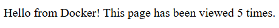

# Лабораторно-практична робота №10

### «Робота з Dockerfile та Docker Compose»

**Мета**: закріпити роботу з базовими директивами Dockerfile та відпрацювати розгортання і керування багатосервісним застосунком (Flask + Redis) за допомогою Docker Compose.

---

## Хід роботи

1) Створено файл `app.py`
2) Створено `dockerfile`
3) Створено `docker‑compose.yml`
4) У терміналі виконано команду: 
```shell
docker compose up --build
```
5) У терміналі виконано команду:
```shell
docker compose down
```

---

## Скріншот лічильника в браузері



---

## Висновки

У ході роботи налаштовано та запущено контейнеризований двосервісний застосунок із використанням Docker Compose. Відпрацьовано створення Dockerfile, опис сервісів, проброс портів, задання залежностей між контейнерами та їх запуск і зупинку. Перевірено коректну взаємодію Flask-застосунку з Redis, що підтверджує працездатність багатосервісної архітектури в контейнерному середовищі.
